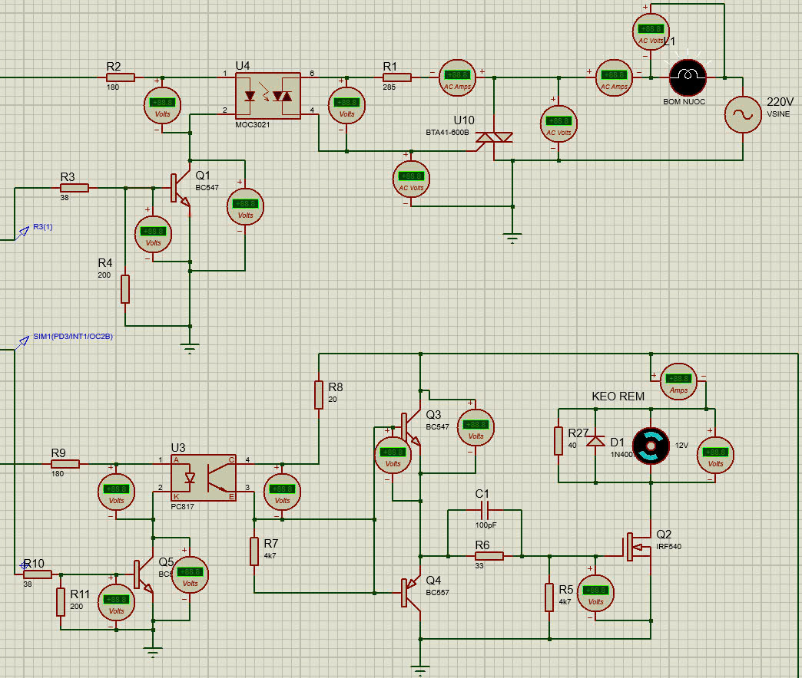
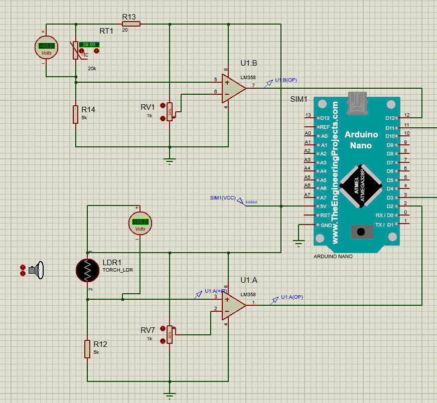
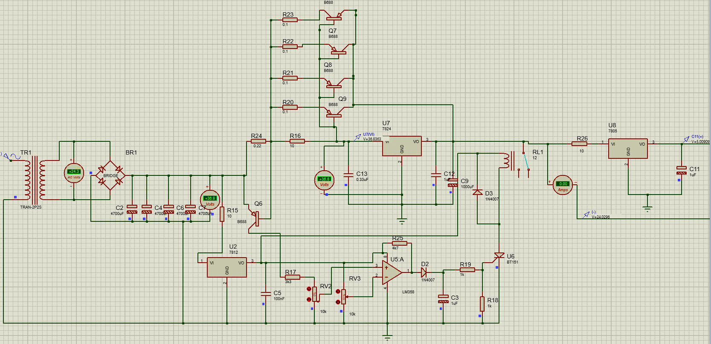
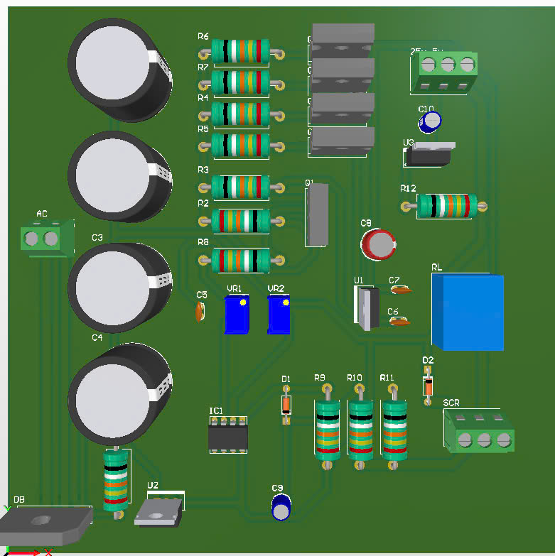
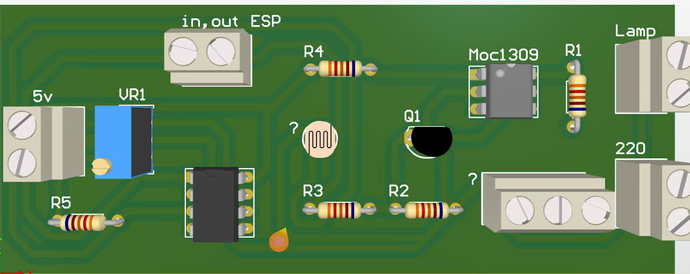
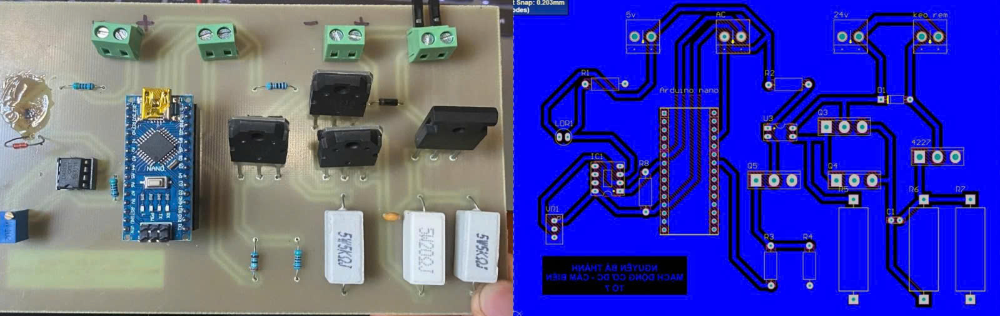

# intern at DUT

## Introduction
- Our products provide a solid and comprehensive foundation of expertise in the field of electronics and programming
- We are proud to fully meet the design requirements for the "motor and sensor control circuit for greenhouses"
- The product includes three main parts: power part, sensor part, motor part
- Each layer is calculated in detail, taking on separate functions, contributing to creating a complete and effective product.
## How the System Works
### System Overview:

**Power part:**

  
**Sensor part:**

  
**Motor part:**

## Quick View of the Project

**Circuit simulation on Proteus software**

**Circuit layout on Altium Design software**

**3D interface on Altium Design software**

**2D interface on Altium Design software**

**Actual interface on Altium Design software**

**Actual interface on Altium Design software**

